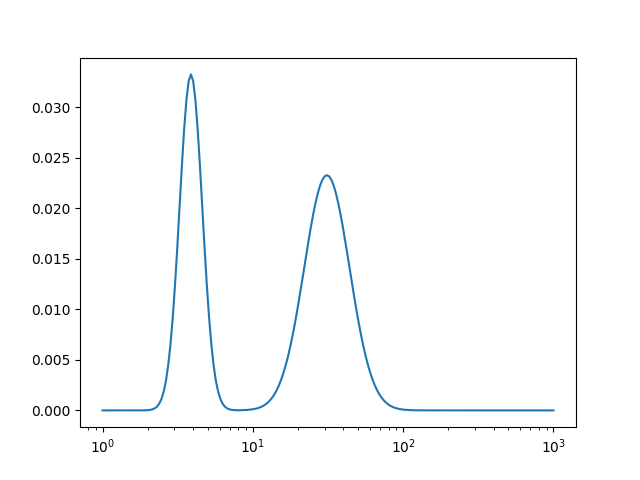
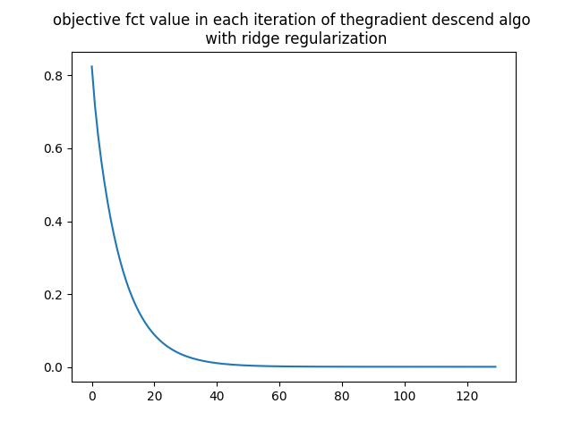
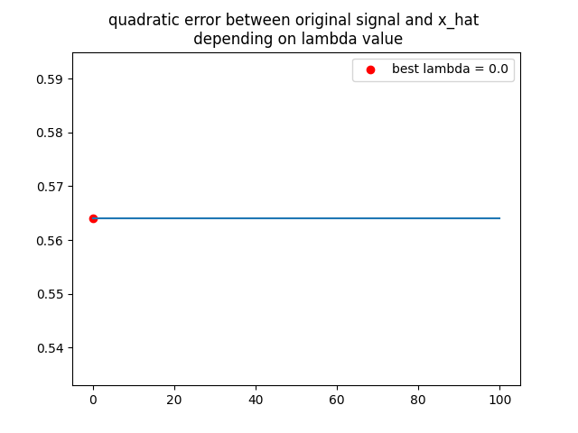
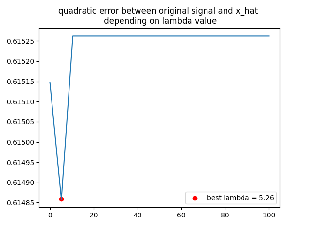

# Scope
Using different optimization algorithms including the gradient descend, the proximal gradient descend and the forward backward primal dual algorithms in order to estimate the optimal solution of the following optimization problem:


# Context
DOSY method (Diffusion Order SpectroscopY) consists of a series of measurements acquired for magnetic pulses of increasing intensities. The degree of attenuation is then proportional to the diffusion coefficient of the molecule which is related to the size and shape of the latter. The data is then analyzed in order to separate the different species of the mixture according to their diffusion coefficient.

# Virtual environment
To run this project, please start by activate the built-in virtual environment. Once in the `spectroscopyrmn` directory, you can use the following command: source bin/activate. No other requirements are needed to run the `.py` files.


# Project
1. Input signal (x_bar) as function of a sampling grid T (x(T)) (see `functions.py`):

\
2. y signal (y(t)) where ```y = K * x + w```
.png "y signal")
\
3. Finding an estimate (x_hat) of the original signal (x_bar) by solving the following optimization problem:

#### a) With ridge regularization:
   
   1. Gradient Descend Algorithm
   With ridge regularization term, we started by using the classic gradient descent algorithm in order to find the solution to this problem. We chose to stop our algorithm once the square of the norm L2 of the gradient is lower than a chosen epsilon value (10e-1, 10e-4), i.e. when the estimate x_hat is near the optimal solution. The decrease of the objective function value in each iteration when running this algorithm can be seen on the following plot: 
   
   The resulting x_hat signal: 
   ")
   When searching for the best hyperparameter lambda, the quadratic error shows that the algorithm is not a good choice for our optimization problem.
   
   The latter results show that the gradient descend is not working well due to the fact that our matrix is **ill-conditioned**, i.e. its condition number is very large.\

   2. Proximal Gradient Descend Algorithm
   A more convenient algorithm to use in this situation is the proximal gradient descend algorithm.  Using, the same stop criteria, the decrease of the objective function value in each iteration when running this algorithm can be seen on the following plot: 
   
   The resulting x_hat signal: 
   ")
   The quadratic error between the original (x_bar) and the estimate (x_hat) signals for the best lambda (=10.53) is equal to ~0.719.
   

#### b) With lasso regularization:
   1. Forward Backward Primal Dual Algorithm
   When using the lasso regularization, both the proximal gradient descend and the gradient descend algorithms are not convenient. Thus, we chose to use the Forward Backward Primal Dual Algorithm.
   The decrease of the objective function value in each iteration when running this algorithm is as following:
   
   The resulting x_hat signal: 
   ")
   The quadratic error between the original (x_bar) and the estimate (x_hat) signals for the best lambda (=10.53) is equal to ~0.738
   


